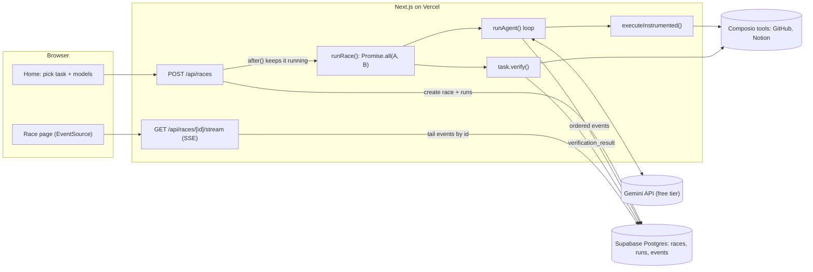

# Agent Arena

Two AI models race side by side on the same real-world, multi-app task. Both get the same [Composio](https://composio.dev) tools and act on real accounts. Every tool call streams live into a split-screen view. When both stop, the server checks the real outcome itself and shows a scorecard.

The point of the demo: **a model saying "done" is worth nothing**. The scorecard's success field comes only from independent verification against GitHub and Notion. In the first race the stronger model claimed success but had put the wrong issue on its page, and verification caught it.

## What a race looks like

1. Pick a task and two Gemini models on the home page.
2. Both agents start at the same moment. Each pane shows the model's step counter, a running timer, and a timeline of tool calls (green for success, red for an error, with the duration), plus any rate-limit pauses.
3. A telemetry strip plots both racers on one time axis, so you can see who is ahead and where each one stalled.
4. When both finish, the server verifies each run and a scorecard animates in: verified success, time, steps, tool errors, tokens, and a winner.

Every race is stored with its full event stream, so the History page can replay it exactly. The Leaderboard aggregates win rate, verified-success rate, average steps and average time per model.

## Architecture



**Request flow.** `POST /api/races` validates the request, refuses to start if another race is in flight, writes a `races` row and two `runs` rows, returns immediately, and keeps the race running inside Next's `after()` (`maxDuration = 300`). Both agents then run concurrently with `Promise.all`.

**The agent loop** ([`src/lib/agent.ts`](src/lib/agent.ts)): send the task and tools to Gemini, run any function calls through Composio, send the results back, and repeat until the model answers in plain text, hits 15 steps, or hits the 3-minute timeout. The transcript is kept by hand with `generateContent` rather than `ai.chats`, so a retried 429 can never leave half a turn in history, and Gemini's thought signatures are passed back unchanged.

**Tool instrumentation** ([`src/lib/instrument.ts`](src/lib/instrument.ts)): every Composio execution, by an agent or by a verifier, goes through one function. It records start time, duration, success and the error message, and it never throws. A tool-reported failure, a thrown SDK error and a timeout all become the same typed `ToolExecution` record. The scorecard's tool-error count comes from here.

**Streaming.** Every meaningful moment becomes an event (`run_started`, `model_thinking`, `tool_call`, `tool_result`, `rate_limited`, `final_answer`, `run_failed`, `verification_result`), written to Postgres in order. Writes go through a small queue, so the agent never waits on the database. The SSE route tails the `events` table by id rather than listening to an in-memory emitter. On serverless, the request that runs the race and the request that streams it are different invocations with no shared memory, so the database is the only reliable channel. Every message carries an SSE `id:`, so a dropped connection resumes from `Last-Event-ID`, and the same endpoint replays finished races.

## Two deliberate design decisions

### 1. Side effects: racers never share a destination

Both agents act on the same connected accounts, so without care they would collide. Each prompt carries the racer's label and the run number, and each agent may only write to its own labeled destination. For the Notion task, that's a page titled `Arena Run 12 — Racer A` under a shared parent page. The system instruction forbids editing, deleting or replying to anything else, including the other racer's output. The run number comes from a `seq` identity column, so artifacts from different races never clash either.

### 2. Verification: never trust the model

After each run, the backend checks the real outcome by calling Composio directly, with no model involved. Each task defines its own `verify()` function. For **GitHub issues to Notion** ([`src/tasks/github-to-notion.ts`](src/tasks/github-to-notion.ts)):

- **Page exists under the parent.** The verifier finds the racer's page by listing the parent's child pages, not by Notion search, because Notion's search index lags behind fresh writes.
- **Issue mentions.** It fetches the newest open issues straight from GitHub, excluding pull requests, and passes only if the page mentions at least 3 of the newest 5. Allowing 3 of 5 means an issue opened mid-race can't fail an honest run.

Failed runs are verified too: an agent can finish the work and then time out before saying so. The winner rules are explicit ([`src/lib/score.ts`](src/lib/score.ts)): only a verified success can win; between two verified finishers the faster one wins; ties fall back to fewer steps, then fewer tokens.

## Engineering notes

- **Free-tier Gemini.** Per-minute 429s and 503s are retried with exponential backoff and jitter. Google's `retryDelay` hint can lengthen a wait but never shorten it, because Gemini sometimes sends `"0s"`. Each pause shows up in the UI as a visible event. A *daily* quota error is detected from its `quotaId` and fails fast with "resets in about N minutes", rather than spending the race on pointless retries.
- **Context size.** Raw provider payloads are mostly metadata. Before a tool result reaches the model, `compactForModel` drops URLs, node ids and avatars and caps long text, which shrinks a 10-issue GitHub response by about 80%. The UI and the verifiers still see the raw data.
- **Gemini schema compatibility.** `@composio/google` passes JSON Schema keywords such as `examples` through to Gemini, which rejects the whole request. A small, tested allow-list sanitizer fixes this ([`src/lib/gemini-schema.ts`](src/lib/gemini-schema.ts)).
- **Pinned toolkit versions.** Both racers and the verifier see identical tool schemas for the whole demo.
- **Strict TypeScript** with no `any` in core logic. Events are a discriminated union that serves as the wire contract between server and browser.

Integration problems hit along the way, with concrete suggestions for Composio, are recorded in [`FRICTION_LOG.md`](FRICTION_LOG.md).

## Tech stack

Next.js 16 (App Router) · TypeScript · Tailwind CSS 4 · `@composio/core` + `@composio/google` · `@google/genai` · Supabase Postgres · Server-Sent Events · Vitest · Vercel. Every service runs on its free tier.

## Run it locally

Requirements: Node 20+, and free accounts on Composio (Platform), Google AI Studio and Supabase. Use test accounts for GitHub and Notion; free-tier model data may be used by the provider.

```bash
git clone https://github.com/SmitPatel-31/Agent-Arena.git
cd Agent-Arena
npm install
cp .env.example .env.local
```

Fill in `.env.local`:

| Variable | Where |
|---|---|
| `COMPOSIO_API_KEY` | Composio **Platform** project → Settings → API Keys (`ak_…`; the `ck_…` consumer key will not work) |
| `GEMINI_API_KEY` | [aistudio.google.com/apikey](https://aistudio.google.com/apikey) |
| `NEXT_PUBLIC_SUPABASE_URL` | Supabase → Project Settings → API |
| `SUPABASE_SERVICE_ROLE_KEY` | Same page, the `service_role` key (server only) |
| `COMPOSIO_USER_ID` | Any id for the demo user, default `arena-demo` |

Then:

1. Run [`supabase/schema.sql`](supabase/schema.sql) once in the Supabase SQL editor.
2. In your demo Notion workspace, create a page titled **Agent Arena**.
3. Connect the accounts. Each command prints a link; when Notion asks which pages to share, include "Agent Arena".
   ```bash
   npm run connect -- github
   npm run connect -- notion
   ```
4. Check everything (env vars, tables, connections, which Gemini models answer):
   ```bash
   npm run check
   ```
5. Start the app at http://localhost:3000:
   ```bash
   npm run dev
   ```

Headless alternatives for the first two build phases:

```bash
npm run agent              # one agent, one task, printed to the terminal
npm run race               # full race persisted to Supabase, scorecard in the terminal
npm test                   # unit tests (instrumentation, retries, verification, scoring, …)
```

## Deploy to Vercel

1. Import the GitHub repository in Vercel. The framework preset (Next.js) is detected automatically.
2. Add the same five environment variables under **Settings → Environment Variables**.
3. Deploy. Races run inside `after()` with `maxDuration = 300`, which needs Vercel's Fluid compute (the default for new projects) to get 300 seconds on the Hobby plan.

## Project structure

```
src/
  lib/
    agent.ts           agent loop (steps, timeout, retries)
    instrument.ts      the single instrumented tool-execution wrapper
    race.ts            runs both racers, then verifies each
    score.ts           winner rules and leaderboard aggregation
    race-state.ts      pure reducer from the event stream to UI state
    composio.ts        Composio client, pinned toolkit versions
    gemini.ts          Gemini client, retry and quota classification
    compact.ts         tool-output compaction for the model context
    db.ts              Supabase persistence
  tasks/
    github-to-notion.ts  prompt + verify() for the Notion task
  app/
    api/races/…        start-race endpoint and SSE stream
    race/[id]/         live race page
    history/, leaderboard/
  components/race/     panes, telemetry strip, start lights, scorecard
scripts/               check, connect, single-agent and terminal-race runners
supabase/schema.sql
```

## Limitations and next steps

- **One task for now.** The task registry is typed and pluggable. The Slack ("summarize the latest message") and Gmail + Calendar ("create tomorrow's event from an email") tasks are designed in the spec but not built yet. Each needs only a prompt, a tool list and a `verify()`.
- **Free-tier quotas shape the model list.** On the free tier, `gemini-3.8-flash` allows about 20 requests a day (roughly three races), so the defaults are Flash-Lite against 3.6 Flash. `npm run check` reports which models currently answer.
- **One race at a time.** The endpoint refuses concurrent races so they can't share the Gemini quota or the demo accounts. A real product would add a queue and per-user auth.
- **No auth on the deployed demo.** Anyone with the URL can start a race against the demo accounts. Writes are confined to labeled pages, but a shared deployment should sit behind a password or an allowlist.
- **Polling-based SSE.** The stream polls Postgres every 400ms. That's simple and works anywhere, but Supabase Realtime (Postgres changes) would cut latency and database reads.
- **Verification is task-specific by design.** Adding stricter content checks, such as comparing each summary against its issue body, would make the benchmark harder to game.
